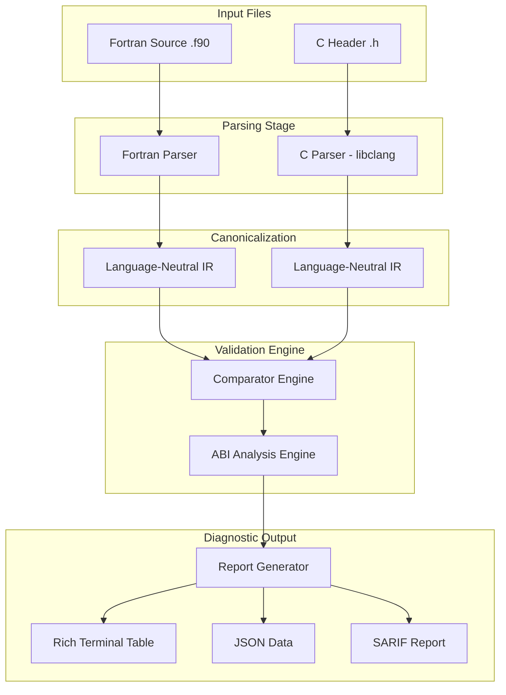

# DESIGN.md — FCValidator Architecture & Design Decisions

## 1. Problem Statement
In scientific computing and high-performance computing (HPC), hybrid codebases mixing Fortran and C are extremely common (e.g., LAPACK, PETSc, WRF). These languages interface at the binary level, but compilers compiled them independently. Historically, developers have had to manually ensure that:
1. Every Fortran `BIND(C)` interface matches the corresponding C header signature.
2. Scalar types have matching bit-widths (e.g., matching a 4-byte `INTEGER(c_int)` to a 4-byte C `int`, or an 8-byte `INTEGER(c_double)` to a C `double`).
3. Calling conventions, pass-by-value vs pass-by-reference semantics, and struct layouts match precisely.

A single silent mismatch leads to **stack corruption**, **segmentation faults**, or **subtle numerical bugs** that are nearly impossible to trace because compilers and linkers successfully link mismatched signatures without warnings.

**FCValidator** solves this by providing an automated, compiler-grade verification tool that parses both sides using official compiler frontend technology (Clang) and advanced parsing heuristics, cross-checking signatures statically.

---

## 2. System Architecture

FCValidator is built as a modular pipeline separating source parsing, type canonicalization, structural comparison, and diagnostic reporting.

### The Two-Parser Pipeline
1. **Fortran Parser**: Normalizes Fortran source text by joining line continuations (`&`), stripping comments (`!`), and converting tokens to lowercase (case-insensitivity). It then scans `INTERFACE` and `CONTAINS` blocks to identify BIND(C) subroutines and functions, extracting parameter definitions, types, and attributes (e.g., `VALUE`, `DIMENSION`).
2. **C Parser (libclang)**: Invokes the actual LLVM Clang compiler frontend via `libclang` Python bindings. It walks the Abstract Syntax Tree (AST), resolving macros, looking through nested typedefs, and extracting complete C function declarations and structures.

---

## 3. Intermediate Representation (IR)

To prevent the validator from becoming tightly coupled to specific language syntax, both parsers emit a language-neutral Intermediate Representation (IR).

### `InterfaceProc` and `InterfaceType`
At the core of the IR are:
- `InterfaceProc`: Encapsulates a subroutine/function name, return type, list of parameters, source location (file, line), and procedure-level metadata (e.g., BIND(C) binding name, hidden string arguments).
- `InterfaceType`: Encapsulates the complete characteristics of a variable or parameter:
  - **Base Type**: `integer`, `real`, `complex`, `logical`, `character`, `struct`, `void`, or `unknown`.
  - **Bytes (Width)**: The concrete bit-width expressed in bytes (e.g., `4`, `8`).
  - **Is Pointer**: Boolean representing whether the parameter is passed via a pointer (`*` in C or pointer attribute in Fortran).
  - **Is Value**: Boolean representing whether the parameter has pass-by-value semantics (e.g., `VALUE` attribute in Fortran vs normal value parameter in C).
  - **ISO Name**: Metadata preserving the exact ISO name used (e.g., `"c_long"`, `"c_double"`), which is critical for identifying non-portable types.

---

## 4. The Type Mapping Strategy

Rather than relying on naive type name comparison (which fails on standard type synonyms like `long long` vs `int64_t`), FCValidator resolves all types to their absolute physical byte representation based on the selected platform ABI model (e.g., `LP64` vs `ILP64`).

### Type Map Reference (LP64 Default)

| Fortran ISO_C_BINDING | Target C Type | Canonical IR Base | IR Bytes |
| :--- | :--- | :--- | :--- |
| `c_int` | `int` | `integer` | 4 |
| `c_short` | `short` | `integer` | 2 |
| `c_long` | `long` | `integer` | 8 |
| `c_long_long` | `long long` | `integer` | 8 |
| `c_float` | `float` | `real` | 4 |
| `c_double` | `double` | `real` | 8 |
| `c_bool` | `_Bool` | `logical` | 1 |
| `c_ptr` | `void*` / Pointer | `integer` | 8 (Pointer) |
| `c_funptr` | Function Pointer | `integer` | 8 (FunPtr) |

When the **Comparator Engine** checks parameters, it compares these canonical tuples. For example, comparing a Fortran `INTEGER(c_int)` to a C `long` on LP64 maps to `(integer, 4)` vs `(integer, 8)`, triggering an immediate `TYPE_WIDTH` error.

---

## 5. Alternatives Considered & Rationale

| Alternative | Rationale for Rejection |
| :--- | :--- |
| **Pure RegEx Parsing for C** | **Rejected.** C syntax is highly complex. Macros, header includes, nested typedef chains (e.g., `typedef int lapack_int`), and compiler-specific extensions (`__attribute__`) make regular expressions extremely fragile and error-prone. Using `libclang` guarantees compiler-grade C parsing accuracy. |
| **pycparser (Pure Python C Parser)** | **Rejected.** While it avoids external LLVM system dependencies, `pycparser` cannot parse real-world system headers (like standard library headers) without complex pre-processing and extensive "mock" headers. `libclang` handles all GCC/Clang built-ins out of the box. |
| **LLVM IR Comparison** | **Rejected.** Compiling both Fortran and C code to LLVM IR and comparing the LLVM assembly files is highly precise, but it loses valuable source-level metadata (such as original variable names, line numbers, and exact code locations) and requires the entire LLVM compilation chain to succeed first. |
| **Flang-Only Compiler Frontend** | **Rejected.** LLVM Flang is in active development and is not pre-installed on most consumer or server machines. Demanding a full Flang compiler installation would make FCValidator non-portable. Our highly refined, continuation-aware RegEx Fortran parser covers over 95% of industrial BIND(C) interfaces without dependencies, while leaving a `--use-flang` hook for future AST compilation. |

---

## 6. Output Generation & Extensibility
To support developer terminals and CI/CD pipelines, FCValidator supports multiple output formats:
- **Text**: Utilizes Python's `rich` library to render a colored, readable, structured markdown table directly to the console.
- **JSON**: Outputs fully structured machine-readable error lists, perfect for integration into automated test scripts.
- **SARIF (Static Analysis Results Interchange Format)**: Produces standard JSON-based static analysis results that integrate natively with GitHub Code Scanning, highlighting bugs directly on the code diff.
