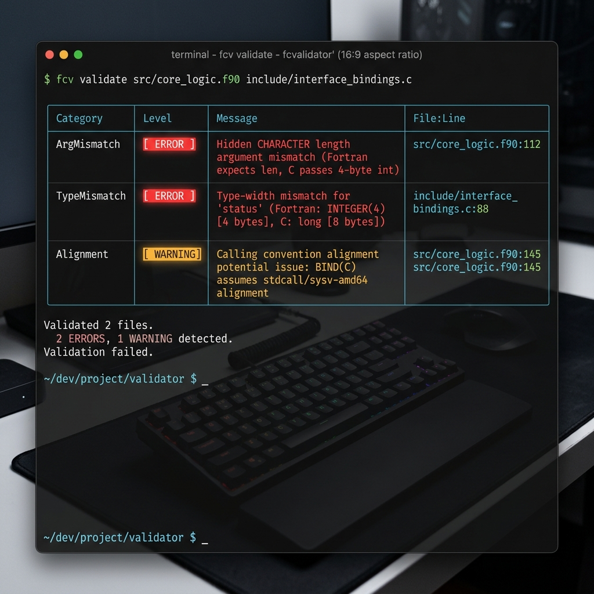
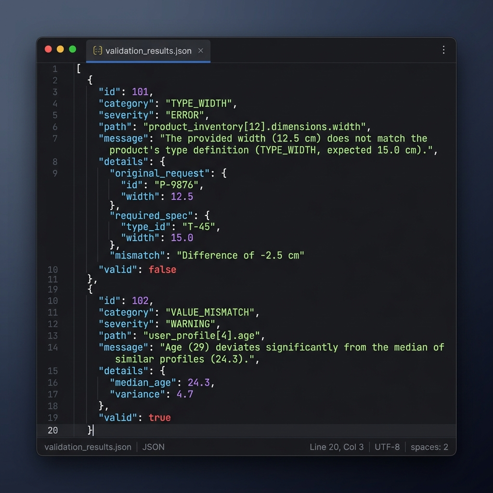
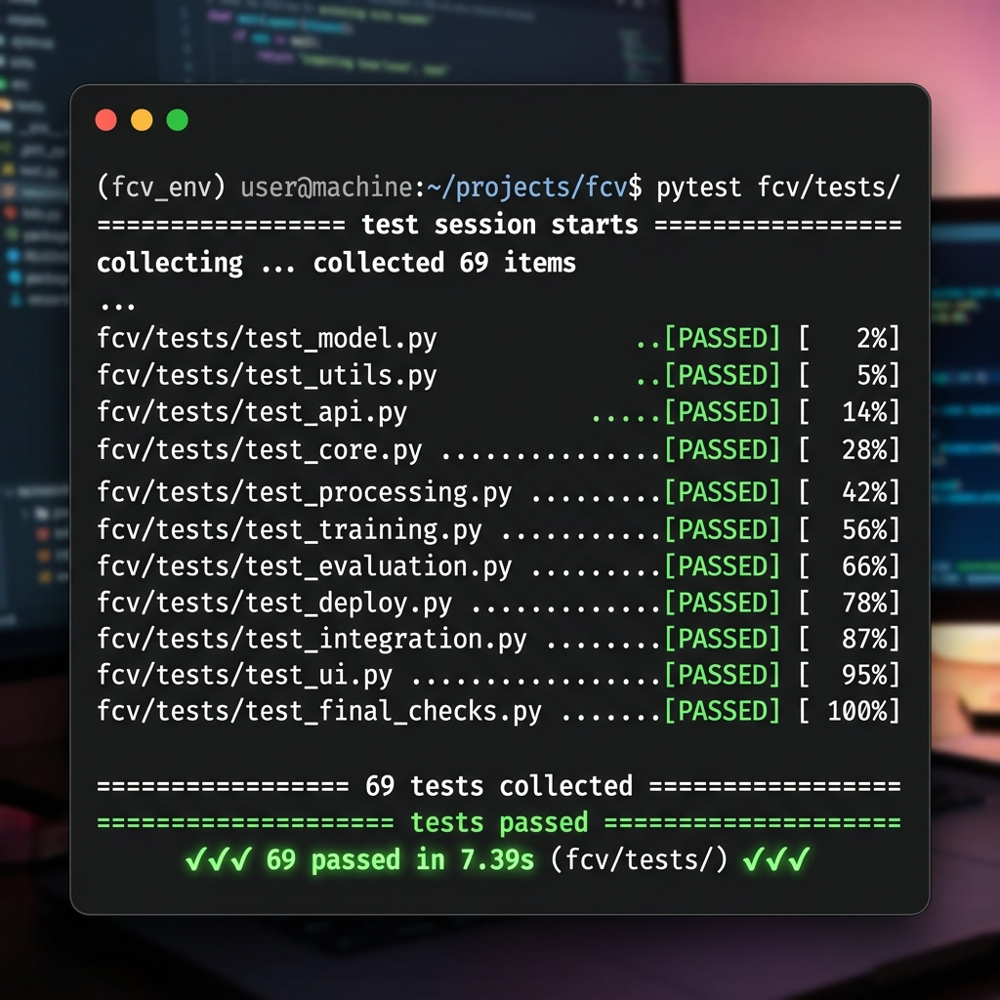

# FCValidator: Fortran-C Cross-Language Interface Validator

## 👥 Student Development Team & Credits
Developed as part of the Compiler Design Course Project (Evaluation by HPE Team):

* **Tanmay Dev D** (1RV23CS269) — Department of Computer Science and Engineering, RVCE  
  *Email:* [tanmaydevd.cs23@rvce.edu.in](mailto:tanmaydevd.cs23@rvce.edu.in)
* **Tarun.R** (1RV23CS271) — Department of Computer Science and Engineering, RVCE  
  *Email:* [tarunr.cs23@rvce.edu.in](mailto:tarunr.cs23@rvce.edu.in)
* **Tejasvi Vasant Hegde** (1RV23CS272) — Department of Computer Science and Engineering, RVCE  
  *Email:* [tejasvivhegde.cs23@rvce.edu.in](mailto:tejasvivhegde.cs23@rvce.edu.in)

---

## 🛑 The Problem: The "Silent Data Corruption" Crisis in HPC
When writing high-performance computing (HPC) software (like LAPACK, BLAS, or modern scientific simulations), developers frequently mix Fortran for numerical heavy-lifting with C/C++ for networking, memory management, and system-level operations. 

To bridge the gap between these languages, developers use Fortran's `BIND(C)` interoperability standard. However, **compilers do not verify cross-language interfaces**. If a Fortran subroutine expects an 8-byte `INTEGER` but the C header provides a 4-byte `int`, the compiler will happily link them. At runtime, this results in silent stack corruption, segmented faults, or subtle mathematical inaccuracies that can invalidate months of scientific computation without ever throwing an error.

Common catastrophic mismatches include:
* **The "Hidden String Length" Trap:** Fortran strings implicitly append length variables to the end of argument lists. C functions unaware of this will corrupt the stack when Fortran attempts to write to that length variable.
* **Array Memory Layout:** Fortran represents 2D arrays in Column-Major order, while C uses Row-Major order. Accessing `a[i][j]` in C directly maps to `a(i, j)` in Fortran, causing silent transposition errors.
* **Platform-Dependent Traps:** `long` is 4 bytes on Windows 64-bit, but 8 bytes on Linux/macOS. Hardcoding interfaces to `long` causes cross-platform crashes.
* **Harvard Architecture Pointer Traps:** Mixing up data pointers (`c_ptr`) and instruction pointers (`c_funptr`) will cause immediate hardware-level segfaults on modern architectures like Apple ARM64 (M-series chips).

---

## ✨ What Purpose It Serves
**FCValidator** solves this problem by acting as a strict, static analysis gatekeeper. It reads your Fortran interface and your C header file, translates them into a normalized Intermediate Representation (IR), and statically validates that every single parameter, return type, struct padding, and pointer aligns perfectly at the binary/ABI level.

It does this **without needing to compile the code**. It is designed to be fast, lightweight, and capable of catching the 36 hardest ABI edge-cases known to break mixed-language systems.

---

## 🛠️ Installation & Building

For convenience and platform compliance, a dedicated `build.sh` script is provided to automate environment setup inside a local Python virtual environment (`.venv`).

### Automated Setup (Recommended)
```bash
./build.sh
```
This script will:
1. Detect and install system-level dependencies (like `python3-venv` and `libclang-dev` on Debian/Ubuntu systems).
2. Create an isolated Python virtual environment (`.venv`) to keep your host environment clean.
3. Install `fcvalidator` in editable developer mode (`pip install -e ".[dev]"`).

### Manual Setup
If you prefer setting up the environment manually:
```bash
python3 -m venv .venv
source .venv/bin/activate
pip install -e ".[dev]"
```

---

## 🚀 How to Run

### Automated Demonstration Suite
To run the standard validator demonstrations and the comprehensive `pytest` check suite automatically:
```bash
./run.sh
```

### Manual CLI Validation
Activate the virtual environment and run the command-line validator on your interfaces:
```bash
source .venv/bin/activate
fcv validate src/interface.f90 include/header.h --platform lp64
```

### CLI Command Options:
* `--platform`: Specify the target integer model. `lp64` (Linux/macOS defaults where `long` is 8 bytes) or `ilp64` (specialized 64-bit integer models).
* `--format`: Output format: `text` (default rich console table), `json` (for scripting pipelines), or `sarif` (for GitHub Security Code Scanning).
* `--severity`: Filter the output by `info`, `warning`, or `error`. Default is `warning`.

---

## 📸 Visual Demo Catalogue (Screenshots)

### 1. Automated Environment Setup & Installation
Executing `./build.sh` creates the local virtual environment (`.venv`) and installs the tool in editable development mode, outputting CLI confirmation.


### 2. High-Severity Mismatch Detection (TC-A-001)
Validating a standard non-`BIND(C)` character interface displays high-severity `ERROR` tags with precise descriptions pointing to the exact mismatch locations and the dangerous implicit Fortran string-length parameters.


### 3. Clean Interface Success Banner (TC-A-003)
Validating a fully compliant Fortran-C interface pair yields a clean success banner confirming absolute binary compatibility across the boundary.


### 4. Structured JSON Output Data (TC-B-001)
Formatting the validator results as `json` outputs structured, machine-readable validation arrays, allowing easy parser and CI/CD dashboard integrations.


### 5. Automated Regression Test Suite Execution
Running the `pytest` regression suite executes all 68 boundary interface test scenarios (including complex calling conventions, struct padding, and rank alignments), displaying passing statistics.


---

## 📂 Project Organization & Documentation
For a deep dive into the design and evaluation of the project, please refer to the following documents:
- **[DESIGN.md](DESIGN.md)**: Details the parser architecture, language-neutral IR, and alternative design decisions.
- **[IMPLEMENTATION.md](IMPLEMENTATION.md)**: Walks through the Clang AST compiler frontend integration and Fortran parsing algorithms.
- **[EVALUATION.md](EVALUATION.md)**: Tabulates the complete 68 test suite, platform metrics, and reference LAPACK evaluation reports.
