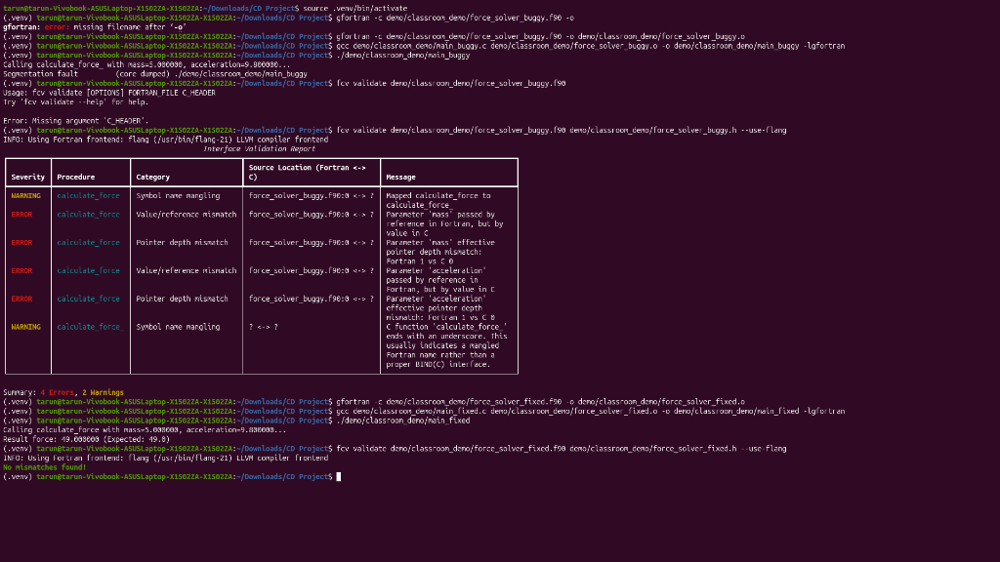

# FCValidator: Fortran-C Cross-Language Interface Validator

## 👥 Student Development Team & Credits
Developed as part of the Compiler Design Course Project (Evaluation by HPE Team):

* **Tanmay Dev D** (1RV23CS269) — Department of Computer Science and Engineering, RVCE  
  *Email:* [tanmaydevd.cs23@rvce.edu.in](mailto:tanmaydevd.cs23@rvce.edu.in)
* **Tarun.R** (1RV23CS271) — Department of Computer Science and Engineering, RVCE  
  *Email:* [tarunr.cs23@rvce.edu.in](mailto:tarunr.cs23@rvce.edu.in)
* **Tejasvi Vasant Hegde** (1RV23CS272) — Department of Computer Science and Engineering, RVCE  
  *Email:* [tejasvivhegde.cs23@rvce.edu.in](mailto:tejasvivhegde.cs23@rvce.edu.in)

---

## 🎬 Video Demonstration Showcase

We have provided a complete keynote-style video walkthrough demonstrating **FCValidator** in action against a real-world scientific HPC simulation:
* **Online Stream (OneDrive Link):** [Watch Video Demonstration](https://1drv.ms/v/c/838889d9a4b62e44/IQABIxRq4Hi8RqEuj9h2iVrmAd3XZ5onEaAMgfwAKfOVsRU?e=bBKwcr)

> [!IMPORTANT]
> **Disclaimer & Evaluation Scope:**
> The video demonstrates how FCValidator is integrated into a professional developer workflow using a custom **HPC Structural FEM Solver Web Dashboard** (built in Flask, dynamically invoking Fortran shared libraries). 
> 
> Please note that the Finite Element Method (FEM) web application is a simulated dashboard. The physical plate stress calculations, boundary loads, and material displacement stubs are simplified simulations constructed to clearly showcase tool behavior. However, the command-line static validation (`fcv validate`), AST compiler-level parsing, type-width matching, and terminal reports are **100% authentic, accurate, and run in real-time**.

To learn more about the demo application and how to run it locally on your system, please refer to the specialized **[demo/README.md](demo/README.md)**.

---

## 🛑 The Problem: The "Silent Data Corruption" Crisis in HPC
When writing high-performance computing (HPC) software (like LAPACK, BLAS, or modern scientific simulations), developers frequently mix Fortran for numerical heavy-lifting with C/C++ for networking, memory management, and system-level operations. 

To bridge the gap between these languages, developers use Fortran's `BIND(C)` interoperability standard. However, **compilers do not verify cross-language interfaces**. If a Fortran subroutine expects an 8-byte `INTEGER` but the C header provides a 4-byte `int`, the compiler will happily link them. At runtime, this results in silent stack corruption, segmented faults, or subtle mathematical inaccuracies that can invalidate months of scientific computation without ever throwing an error.

Common catastrophic mismatches include:
* **The "Hidden String Length" Trap:** Fortran strings implicitly append length variables to the end of argument lists. C functions unaware of this will corrupt the stack when Fortran attempts to write to that length variable.
* **Array Memory Layout:** Fortran represents 2D arrays in Column-Major order, while C uses Row-Major order. Accessing `a[i][j]` in C directly maps to `a(i, j)` in Fortran, causing silent transposition errors.
* **Platform-Dependent Traps:** `long` is 4 bytes on Windows 64-bit, but 8 bytes on Linux/macOS. Hardcoding interfaces to `long` causes cross-platform crashes.
* **Harvard Architecture Pointer Traps:** Mixing up data pointers (`c_ptr`) and instruction pointers (`c_funptr`) will cause immediate hardware-level segfaults on modern architectures like Apple ARM64 (M-series chips).

---

## ✨ What Purpose It Serves
**FCValidator** solves this problem by acting as a strict, static analysis gatekeeper. It reads your Fortran interface and your C header file, translates them into a normalized Intermediate Representation (IR), and statically validates that every single parameter, return type, struct padding, and pointer aligns perfectly at the binary/ABI level.

It does this **without needing to compile the code**. It is designed to be fast, lightweight, and capable of catching the 58 hardest ABI edge-cases known to break mixed-language systems.

---

## 🛠️ Installation & Building

For convenience and platform compliance, a dedicated `build.sh` script is provided to automate environment setup inside a local Python virtual environment (`.venv`).

### Automated Setup (Recommended)
```bash
./build.sh
```
This script will:
1. Detect and install system-level dependencies (like `python3-venv` and `libclang-dev` on Debian/Ubuntu systems).
2. Create an isolated Python virtual environment (`.venv`) to keep your host environment clean.
3. Install `fcvalidator` in editable developer mode (`pip install -e ".[dev]"`).

### Manual Setup
If you prefer setting up the environment manually:
```bash
python3 -m venv .venv
source .venv/bin/activate
pip install -e ".[dev]"
```

---

## 🚀 How to Run

### Automated Demonstration Suite
To run the standard validator demonstrations and the comprehensive `pytest` check suite automatically:
```bash
./run.sh
```

### Manual CLI Validation
Activate the virtual environment and run the command-line validator on your interfaces:
```bash
source .venv/bin/activate
fcv validate src/interface.f90 include/header.h --platform lp64
```

### CLI Command Options:
* `--platform`: Specify the target integer model. `lp64` (Linux/macOS defaults where `long` is 8 bytes), `ilp64` (specialized 64-bit integer models), or `llp64` (Windows 64-bit model where `long` is 4 bytes).
* `--format`: Output format: `text` (default rich console table), `json` (for scripting pipelines), or `sarif` (for GitHub Security Code Scanning).
* `--severity`: Filter the output by `info`, `warning`, or `error`. Default is `warning`.

---

## 🖥️ Troubleshooting Clang System Headers
Because `libclang` parses C headers using actual compiler frontends, it requires access to standard system headers (e.g., `<stdint.h>`, `<stddef.h>`).
* **Ubuntu/Debian:** Ensure `libclang-dev` is installed (handled automatically by `./build.sh`).
* **Windows (PowerShell):** If Clang cannot resolve system headers, configure your shell include environment variable pointing to Visual Studio or compiler directories:
  ```powershell
  $env:C_INCLUDE_PATH="C:\Program Files (x86)\Microsoft Visual Studio\2022\BuildTools\VC\Tools\MSVC\<version>\include"
  ```

---

## 🤖 CI/CD Integration (GitHub Actions)
Integrate `fcvalidator` directly into your pull-request pipeline to block mismatched interfaces before they are merged:
```yaml
name: ABI Static Verification
on: [push, pull_request]

jobs:
  validate-abi:
    runs-on: ubuntu-latest
    steps:
      - uses: actions/checkout@v3
      - name: Set up Python
        uses: actions/setup-python@v4
        with:
          python-version: '3.10'
      - name: Install Compilers & FCValidator
        run: |
          sudo apt-get install -y libclang-dev gfortran flang-21
          pip install .
      - name: Run Verification
        run: |
          fcv validate src/interface.f90 include/header.h --use-flang --format sarif > fcv-results.sarif
      - name: Upload SARIF Results
        uses: github/codeql-action/upload-sarif@v2
        with:
          sarif_file: fcv-results.sarif
```

---

## 📂 Project Organization & Documentation
For a deep dive into the design and evaluation of the project, please refer to the following documents in the workspace:
- **[docs/design.md](docs/design.md)**: Details the parser architecture, language-neutral IR, and alternative design decisions.
- **[docs/user_guide.md](docs/user_guide.md)**: Comprehensive CLI usage guide with full command-line help outputs and syntax parameters.
- **[docs/type_mapping_reference.md](docs/type_mapping_reference.md)**: Tabulates all supported type mappings across Fortran ISO bindings and C standard types.
- **[docs/lapack_report.md](docs/lapack_report.md)**: Statically generated cross-language validation report

## 🎓 Hands-On Tutorial: Finding and Fixing Silent ABI Mismatches

This self-contained tutorial provides a step-by-step example of compiling a mixed Fortran-C program with a hidden ABI flaw, watching it crash at runtime, using `fcv` to diagnose it, and running the corrected version.

All source code files for this tutorial are located in the `demo/classroom_demo/` directory.

### 1. The Buggy Implementation

#### Buggy Fortran Code ([force_solver_buggy.f90](demo/classroom_demo/force_solver_buggy.f90))
```fortran
subroutine calculate_force(mass, acceleration, force)
    double precision, intent(in) :: mass
    double precision, intent(in) :: acceleration
    double precision, intent(out) :: force

    force = mass * acceleration
end subroutine calculate_force
```

#### Buggy C Header ([force_solver_buggy.h](demo/classroom_demo/force_solver_buggy.h))
```c
void calculate_force_(double mass, double acceleration, double* force);
```

#### Buggy C Main Caller ([main_buggy.c](demo/classroom_demo/main_buggy.c))
```c
#include <stdio.h>

extern void calculate_force_(double mass, double acceleration, double* force);

int main() {
    double mass = 5.0;
    double acceleration = 9.8;
    double force = 0.0;

    printf("Calling calculate_force_ with mass=%f, acceleration=%f...\n", mass, acceleration);
    fflush(stdout);

    calculate_force_(mass, acceleration, &force);

    printf("Result force: %f\n", force);
    return 0;
}
```

---

### 2. What Was Wrong & What Was Happening?

When compiling and executing this buggy program, it crashes immediately with a **Segmentation Fault (core dumped)**:

```bash
gfortran -c demo/classroom_demo/force_solver_buggy.f90 -o demo/classroom_demo/force_solver_buggy.o
gcc demo/classroom_demo/main_buggy.c demo/classroom_demo/force_solver_buggy.o -o demo/classroom_demo/main_buggy -lgfortran
./demo/classroom_demo/main_buggy
# Output: Segmentation fault (core dumped)
```

#### Low-Level Binary Explanation:
* **Value vs. Reference Mismatch**: 
  - *The Bug:* In C, the arguments `mass` and `acceleration` are passed **by value** (`double`), which loads the raw floating-point bits (for `5.0` and `9.8`) directly into CPU registers or stack slots. However, on the Fortran side, legacy arguments are passed **by reference** (expecting pointers).
  - *The Consequence:* When Fortran attempts to compute `force = mass * acceleration`, it interprets the registers containing `5.0` and `9.8` as **64-bit memory addresses** (pointers). It tries to dereference these addresses, leading to a memory access violation (accessing non-existent memory addresses like `0x4014000000000000`), which causes an immediate hardware-level **Segmentation Fault**.
* **Symbol Name Mangling**:
  - *The Bug:* The legacy Fortran subroutine compiles into the binary symbol `calculate_force_` (appended trailing underscore). C has to manually reference this mangled name, violating portability rules.

---

### 3. Running the `fcv` Tool on the Buggy Code

To diagnose these silent mismatches before compiling or linking, activate the environment and validate:
```bash
source .venv/bin/activate
fcv validate demo/classroom_demo/force_solver_buggy.f90 demo/classroom_demo/force_solver_buggy.h --use-flang
```

The tool will parse the ASTs and immediately report the mismatches:
* **`Value/reference mismatch`**: Flags that `mass` and `acceleration` are passed by reference in Fortran but by value in C.
* **`Pointer depth mismatch`**: Flags that Fortran expects 1 pointer level whereas C provides 0.

---

### 4. Moving Forward: The Fixed Implementation

To fix the ABI violations, we standardise the interfaces utilizing modern Fortran-C interoperability specs (`iso_c_binding` and `BIND(C)`):

#### Fixed Fortran Code ([force_solver_fixed.f90](demo/classroom_demo/force_solver_fixed.f90))
```fortran
subroutine calculate_force(mass, acceleration, force) bind(C, name="calculate_force")
    use iso_c_binding
    real(c_double), value, intent(in) :: mass
    real(c_double), value, intent(in) :: acceleration
    real(c_double), intent(out) :: force

    force = mass * acceleration
end subroutine calculate_force
```

#### Fixed C Header ([force_solver_fixed.h](demo/classroom_demo/force_solver_fixed.h))
```c
void calculate_force(double mass, double acceleration, double* force);
```

#### Fixed C Main Caller ([main_fixed.c](demo/classroom_demo/main_fixed.c))
```c
#include <stdio.h>

void calculate_force(double mass, double acceleration, double* force);

int main() {
    double mass = 5.0;
    double acceleration = 9.8;
    double force = 0.0;

    printf("Calling calculate_force with mass=%f, acceleration=%f...\n", mass, acceleration);
    fflush(stdout);

    calculate_force(mass, acceleration, &force);

    printf("Result force: %f (Expected: 49.0)\n", force);
    return 0;
}
```

---

### 5. Compiling and Verifying the Corrected Version

#### Compile and run the fixed code:
```bash
gfortran -c demo/classroom_demo/force_solver_fixed.f90 -o demo/classroom_demo/force_solver_fixed.o
gcc demo/classroom_demo/main_fixed.c demo/classroom_demo/force_solver_fixed.o -o demo/classroom_demo/main_fixed -lgfortran
./demo/classroom_demo/main_fixed
# Output:
# Calling calculate_force with mass=5.000000, acceleration=9.800000...
# Result force: 49.000000 (Expected: 49.0)
```

#### Verify with `fcv`:
```bash
fcv validate demo/classroom_demo/force_solver_fixed.f90 demo/classroom_demo/force_solver_fixed.h --use-flang
# Output:
# No mismatches found! The interfaces are binary-compatible.
```

---

### 📸 Terminal Execution History

Below is a complete recording of the terminal execution showing the buggy crash, detection of the errors by `fcv`, compiling the fixed version, and successfully computing the result:


