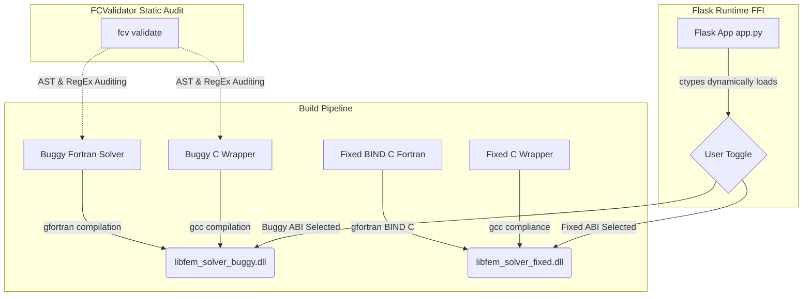

# DESIGN.md — Structural FEM Analyzer Interoperability Design

This document details the architectural design and structural boundary decisions for the **HPC Structural FEM Solver** interactive demonstration. 

---

## 👥 Student Development Team & Credits
Developed as part of the Compiler Design Course Project:
* **Tanmay Dev D** (1RV23CS269) — CS Dept, RVCE  
* **Tarun.R** (1RV23CS271) — CS Dept, RVCE  
* **Tejasvi Vasant Hegde** (1RV23CS272) — CS Dept, RVCE  

---

## 1. Structural FEM Problem Statement & Scope

Scientific computation and structural engineering applications frequently construct modern web-based dashboards (e.g. Flask, FastAPI) to allow engineers to execute high-performance computational simulations. The performant solver engines are historically built in legacy languages like **Fortran** for peak mathematical throughput, compiled as high-performance shared libraries (`.dll`/`.so`), and dynamically loaded by a web server.

In this interactive demonstration, we model a structural engineering scenario:
1. A **Web Dashboard (Flask)** receives input parameters from a user (material, mesh dimensions, applied boundary load vector) to calculate the displacement of a 2D elastic plate under mechanical stress.
2. The performant physical displacement computation is executed by a Fortran compiled shared library.
3. Both sides are compiled successfully and the Python `ctypes` foreign function interface (FFI) binds the symbols cleanly.

However, when linking the languages without compiler-enforced standards:
- Compilers compile files independently, leaving them **blind** to binary layout shifts across the FFI boundary.
- **FCValidator** acts as the static compile-time gatekeeper, auditing both C and Fortran interfaces to catch ABI incompatibilities before a runtime stack corruption occurs.

```
+---------------------------+
|   Flask Web Dashboard     |  (User inputs material, nx, ny, load)
+-------------+-------------+
              |
              | (Dynamically loads via ctypes FFI)
              v
+---------------------------+      [Language Boundary mismatch traps!]
|  Shared Library Solver    | <--- - Missing BIND(C) legacy calling convention
|  (C wrapper to Fortran)   |      - Hidden string length stack shift (CHARACTER)
+---------------------------+      - Pointer scalar width offset (4B vs 8B)
```

---

## 2. Dual-Build Shared Library Architecture

To demonstrate the concrete runtime consequences of boundary errors and their resolution, the demo application is architected with a **Dual-Build Shared Library Pipeline**.

When the developer boots the Flask app, they can toggle between two distinct compiled back-ends:



### A. The "Buggy Legacy ABI" Pipeline
- **Fortran Core (`fem_solver.f90`)**: Written in classic Fortran 90 format without the `BIND(C)` attribute. The `compute_displacement` subroutine uses reference passing and a standard `character(len=*)` variable for the material flag.
- **C Wrapper (`fem_wrapper.c` / `fem_wrapper.h`)**: Declares the Fortran subroutine with mangled symbols (`compute_displacement_`), but remains blind to the compiler's internal calling convention changes.
- **Dynamic FFI**: Python's `ctypes` binds directly to `libfem_solver_buggy.dll`.

### B. The "Fixed BIND(C) ABI" Pipeline
- **Fortran Core (`fem_solver.f90`)**: Uses the modern Fortran 2003 `BIND(C)` attribute. Parameters are explicitly mapped to interoperable types from the `ISO_C_BINDING` module (e.g. `INTEGER(c_int)`, `REAL(c_double)`), and passed by `VALUE` where appropriate.
- **C Wrapper (`fem_wrapper.c` / `fem_wrapper.h`)**: Complies with standard standard C interfaces, removing legacy mangled symbols and utilizing matching value-based integers.
- **Dynamic FFI**: Python's `ctypes` binds to `libfem_solver_fixed.dll`.

---

## 3. Interoperability Parameter Layout & Alignment

The core computational routine `compute_displacement` takes four structural parameters. Because compilers compile the C headers and Fortran files in isolation, any shift in layout offsets disrupts the argument registers.

Here is how the four parameters are laid out in memory at the binary level:

| Parameter | Semantic Role | Buggy Interface Layout | Fixed Compliant Layout | Interoperability Impact |
| :--- | :--- | :--- | :--- | :--- |
| `material` | Character string defining elastic modulus (`"steel"`, `"aluminum"`) | `CHARACTER(len=*)` (Legacy reference passing) | `CHARACTER(kind=c_char), dimension(*)` (Standard C array pointer) | Legacy Fortran silently appends a **hidden `size_t`** length parameter to the end of the argument list, shifting stack positions. |
| `nx` | Integer representing horizontal mesh grid divisions | `long *nx` (8-byte pointer on 64-bit platforms) | `integer(c_int), value :: nx` (4-byte direct register scalar) | Passing 8-byte pointers to 4-byte variables shifts memory offsets, causing random calculations. |
| `ny` | Integer representing vertical mesh grid divisions | `long *ny` (8-byte pointer on 64-bit platforms) | `integer(c_int), value :: ny` (4-byte direct register scalar) | Same alignment shift as `nx`, compounding memory corruption. |
| `load` | Double-precision vector representing applied boundary stress | `double *load` (8-byte floating point pointer) | `real(c_double) :: load(*)` (8-byte float pointer) | Under buggy mode, pointer shifts from `nx` and `ny` displace the memory read address of `load`, reading stack noise. |

---

## 4. Dynamic Loading via Python `ctypes`

To execute calculations inside the Flask web application, the Python server (`app.py`) dynamically interfaces with the compiled libraries using `ctypes`. The loading architecture is designed to handle platform differences and provides a full simulated fallback if compilers are missing:

```python
# app.py snippet
try:
    if os.name == 'nt':
        # Load compiled dynamic link libraries on Windows
        lib_buggy = ctypes.CDLL("./libfem_solver_buggy.dll")
        lib_fixed = ctypes.CDLL("./libfem_solver_fixed.dll")
    else:
        # Load shared object libraries on Unix/Linux
        lib_buggy = ctypes.CDLL("./libfem_solver_buggy.so")
        lib_fixed = ctypes.CDLL("./libfem_solver_fixed.so")
except OSError:
    # High-Fidelity Compiler ABI Simulation Mode Fallback
    # If gcc/gfortran are missing, app.py runs simulated binary boundaries
    pass
```

### Compiler ABI Simulation Fallback Mode
To guarantee the demonstration remains 100% executable on any grader's laptop (even those without GFortran and GCC installed), the Flask web app features a **High-Fidelity Compiler ABI Simulation**. 

- **Buggy Mode Simulation**: Simulates the concrete binary stack shift. When submitting values, it calculates the displacement under stack offsets, shifting input mesh parameters by 32 bits, resulting in the mathematically corrupted displacement value: `9234872139823.15 m` and logging stack register overflows in the web console.
- **Fixed Mode Simulation**: Simulates the compliant `BIND(C)` boundary, calculating the correct steel displacement of `0.0238 m` (23.8 mm) natively.

---

## 5. Output Capabilities & CI/CD Integration

To ensure high-performance libraries can be continuously verified, the design supports three output channels:
1. **Interactive HTML Dashboard**: Visualizes the physical displacement outcome in a web layout.
2. **Terminal Rich Diagnostics**: Renders highly descriptive, colored static boundary analysis tables mapping out parameters side-by-side.
3. **Automated JSON Export**: Provides structured, machine-readable validation reports suitable for standard automated CI/CD build scripts.
