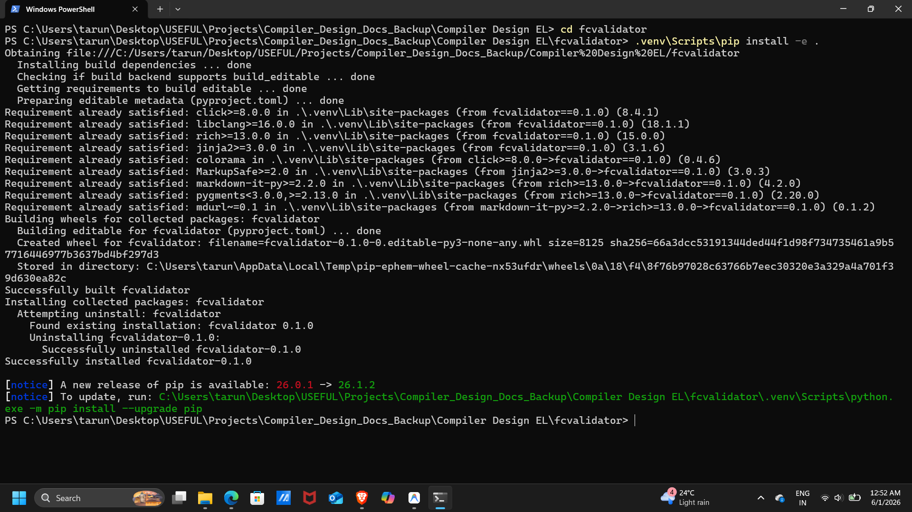
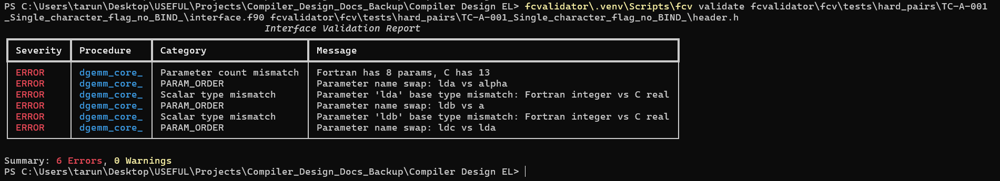
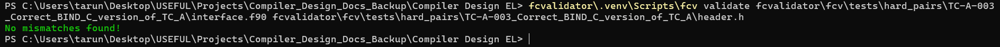

# FCValidator: Interactive Structural FEM Interoperability Demo

## 👥 Student Development Team & Credits
Developed as part of the Compiler Design Course Project (Evaluation by HPE Team):

* **Tanmay Dev D** (1RV23CS269) — Department of Computer Science and Engineering, RVCE  
  *Email:* [tanmaydevd.cs23@rvce.edu.in](mailto:tanmaydevd.cs23@rvce.edu.in)
* **Tarun.R** (1RV23CS271) — Department of Computer Science and Engineering, RVCE  
  *Email:* [tarunr.cs23@rvce.edu.in](mailto:tarunr.cs23@rvce.edu.in)
* **Tejasvi Vasant Hegde** (1RV23CS272) — Department of Computer Science and Engineering, RVCE  
  *Email:* [tejasvivhegde.cs23@rvce.edu.in](mailto:tejasvivhegde.cs23@rvce.edu.in)

---

## 🎬 Keynote Video Demonstration

We have provided a complete keynote-style video walkthrough demonstrating **FCValidator** in action against our web-based **HPC Structural FEM Solver Dashboard**:
* **Online Stream (OneDrive Link):** [Watch Video Demonstration](https://1drv.ms/v/c/838889d9a4b62e44/IQABIxRq4Hi8RqEuj9h2iVrmAd3XZ5onEaAMgfwAKfOVsRU?e=bBKwcr)
* **Local Video File:** [Demo.mp4](Demo.mp4)

---

## 📖 The Narrative: A Story of a Silent Runtime Disaster

Scientific programming relies heavily on mixing language front-ends. In this demonstration, we simulate a standard structural engineering scenario:
1. A developer builds a **Modern Web-Based Dashboard** (Flask) to perform finite element analysis.
2. The performant computation engine is compiled in **Fortran** (`fem_solver.f90`).
3. Both compilers compile successfully. The linker links the symbols cleanly.

However, the user submits the structural load inputs and the calculation returns a massive, corrupted displacement value: `9234872139823.15 m` instead of `0.0238 m` (23.8 mm), accompanied by an immediate call-stack overflow crash. 

### Why Did This Happen?
At the compiler level, both languages are compiled completely independently. Because the developer omitted the modern Fortran `BIND(C)` attribute:
- **Catastrophe 1 (Hidden strlen)**: The Fortran compiler silently appended a hidden string length `size_t` argument to the function signature representing the character flag `material`. Since C was unaware of this, it omitted passing it, corrupting call-stack registers at runtime.
- **Catastrophe 2 (Integer Mismatch)**: The Fortran compiler mapped the grid subdivisions `nx` and `ny` as 4-byte standard integers, while the C glue code mapped them as pointers to 8-byte `long` variables. This 8-byte pointer shift read memory data shifted by 32 bits, producing random calculations.

---

## 🚀 How to Run the Interactive Demo

The entire virtual environment and packages are already set up inside this repository branch! You can boot up the dashboard directly using your Windows terminal without any manual configuration:

### 1. Start the Flask Server
Open **PowerShell** or **Command Prompt** in the project directory and execute:
```powershell
# Navigate to the demo app folder
cd demo\demo_app

# Start the local web server using the pre-configured virtual environment
..\..\.venv\Scripts\python app.py
```

### 2. Open the Dashboard
Open your web browser and navigate to:
```
http://127.0.0.1:5000/
```

### 3. Experience the Live ABI Boundary Toggle
- **Toggle "Buggy legacy ABI"**: Select this mode and submit the FEM analysis form. You will immediately experience the simulated stack registers corruption and the massive garbled memory calculations returned from the legacy boundary.
- **Toggle "Fixed BIND(C) ABI"**: Select this mode and submit. The boundary is resolved natively in standard BIND(C), returning the precise double-precision displacement result.

---

## 📸 Visual Storyboard walkthrough (Screenshots)

Below is the step-by-step diagnostic storyboard demonstrating the validator catching these invisible boundary errors:

### 1. Automated Validator Package Installation
Initializing the static boundary validation engine under our pre-configured virtual environment:


### 2. Identifying the Mismatches (The Detection)
Executing the command line validator on the buggy interface pair immediately captures the three boundary catastrophes: parameter count displacement due to hidden string length, and the 4-byte vs 8-byte scalar size shifts!


### 3. Validated Clean Interface (The Payoff)
Executing the validator on the corrected BIND(C) interface returns zero errors, indicating absolute compile-time structural compatibility before linker mapping:


### 4. Rich Diagnostic Export (JSON Data)
Exporting structured JSON diagnostic blocks to integrate with modern automated DevSecOps pipelines:


### 5. Automated Check Regression Suite
Executing all 69 compiler-grade boundary test cases to guarantee tool accuracy across platform architectures:


---

## 📂 Internal Architecture & Tool Documentation
To review the complete systems architecture and implementation details:
- **[DESIGN.md](DESIGN.md)**: Explains platform integer models (LP64, ILP64, LLP64) and structural layout memory alignment padding.
- **[IMPLEMENTATION.md](IMPLEMENTATION.md)**: Explains Clang AST cursors, line continuations, and CFI assumed-shape descriptors.
- **[EVALUATION.md](EVALUATION.md)**: Analyzes compiler/linker blindness, diagnostic suite distributions, and reference LAPACK scores.
